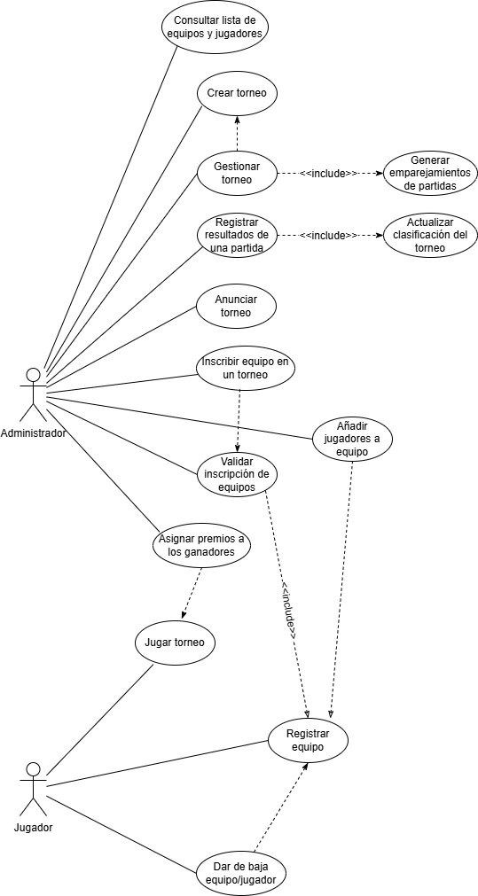
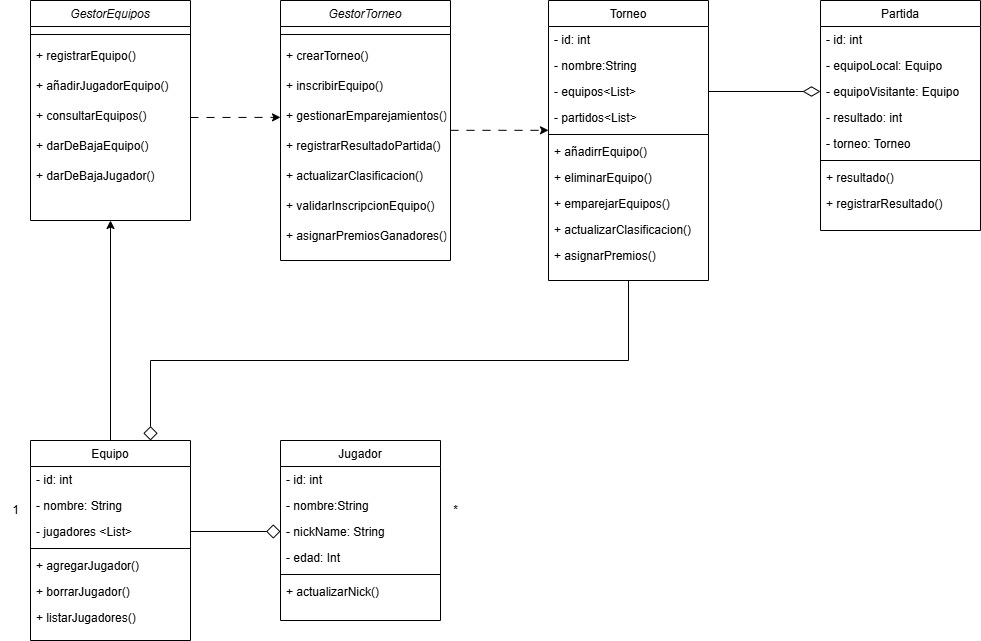

# torneo-esports-uml
Tarea del tercer trimestre de la asignatura EEDD

# Sistema de Gestión de Torneos de eSports

## Autor

Aarón Díaz Hernández

Aarondh84

## Descripción del Proyecto

https://github.com/Aarondh84/torneo-esports-uml.git

Este proyecto implementa un sistema de gestión de torneos de eSports utilizando UML para el modelado.

## Diagramas UML

### Diagrama de Casos de Uso 

### Diagrama de Clases 

## Estructura del Proyecto 
torneo-esports-uml/
├── diagrams/ 
│ ├── casos-uso.png 
│ ├── clases.png 
├── README.md 
├── .gitignore 

## Justificación del diseño 

Se ha elegido un diseño basado en el lenguaje UML dado que el mismo permite visualizar, especificar y documentar gráficamente las partes de las que comprende el desarrollo del software.

A su vez durante la realización del diseño, se ha podido ir viendo los resultados del mismo, lo cual ha permitido ir modificando el diseño al ver posibles mejoras o puntos que no quedaban muy claros.

Por otra parte, con este tipo de diseño nos podemos asegurar que otro desarrollador lo pueda interpretar sin ambigüedad.

## Conclusiones

Desarrollar el proyecto mediante UML me ha permitido ir viendo como al ir evolucionando el mismo, se me ocurrían nuevas ideas sobre cómo podría trabajar el sistema e ir modificando el proyecto en ese momento.

Por otra parte, no me he visto cómodo con el desarrollo del diagrama de clases y he tenido que darle muchas vueltas antes de hacer la entrega, supongo que en el momento en el que tenga que desarrollar el codigo en java, se me hara mas visualmente compresible.
